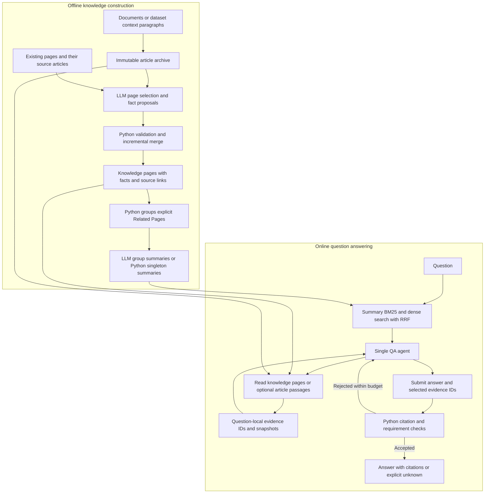

# LLM-Wiki

Azure GLM 5.2 Fast and Qwen3-Embedding-8B setup and bounded smoke test:
[Azure model integration](docs/azure-models.md).

LLM-Wiki turns documents into a persistent, linked knowledge base and answers
questions using evidence read from that knowledge base. It separates **offline
knowledge construction** from **online question answering**: articles are archived,
facts accumulate on knowledge pages, and summaries help a single QA agent find the
pages it needs.

The model proposes facts, relationships, and answers. Python manages storage,
preserves earlier knowledge, builds navigation groups, and validates citations
against the text actually delivered to the agent.

## Architecture



### Three document layers

| Layer           | Contents                                                                                                                                         | Role in QA                                                                             |
| --------------- | ------------------------------------------------------------------------------------------------------------------------------------------------ | -------------------------------------------------------------------------------------- |
| Articles        | Byte-for-byte copies of processed Markdown articles under `sources/articles/<sha256>.md`. Changed content has a different hash and archive path. | Optional source passages for additional detail, ambiguity, conflicts, or verification. |
| Knowledge pages | Entity, concept, event, or other configured pages containing facts, article links, explained relationships, and update records.                  | Read facts can directly support an answer.                                             |
| Summaries       | One level of navigation summaries with explicit member-page links and content fingerprints.                                                      | Retrieval entry points; summaries cannot serve as final answer evidence.               |

The Wiki uses Markdown and YAML frontmatter on disk. Summary embeddings are
cached in SQLite and searched locally; no vector database is required.

## How the system works

### 1. Prepare and archive articles

Dataset preprocessing writes Markdown articles and a separate `qa_pairs.jsonl`.
For HotpotQA, it extracts all context paragraphs, including distractors, and
deduplicates exact **title and paragraph-text pairs**. Gold answers and supporting
titles are stored with the QA records; they do not select the ingestion articles.
An archived HotpotQA article is a processed dataset paragraph, not a full
Wikipedia page.

Wiki initialization creates the configured page-type directories and retains
generic `entities` and `concepts` categories. First-time purpose and page-type
initialization can call the LLM, with fallback configuration if initialization
fails. It does not create factual knowledge pages.

### 2. Compile facts into knowledge pages

For each article batch, `bench_ingest.ingest_batch()`:

1. Checks content hashes and successful build receipts to skip reusable articles.
2. Archives the input articles. If knowledge pages already exist, a selection
   model chooses up to 15 existing pages to read for updates or relationships.
   An empty Wiki skips this selection step.
3. Gives the generation model the input articles, selected page contents, their
   existing source articles, fact IDs, and allowed page types.
4. Receives a JSON proposal containing page paths, facts with article references,
   and Related Pages links with explanations.
5. Validates paths, article hashes, references, update records, and citation
   coverage for every input article before writing knowledge pages.
6. Renders Markdown, records successful articles, and rebuilds navigation indexes.

Each fact must reference at least one supplied article. At construction time,
the model supplies article paths; it does not copy exact quotations or calculate
line ranges. Article-reference validation establishes the source location, while
the model remains responsible for extracting facts supported by that source.

Rejected proposals receive validation feedback for up to two corrective retries.
If a multi-article proposal still fails validation, ingestion retries each article
individually against the latest Wiki. Unresolved failures remain retryable and
write diagnostics to `.build/failures/`.

### 3. Preserve knowledge as new articles arrive

Updates add information to the same page while preserving earlier facts, source
links, relationships, and metadata. Aliases and tags are combined. Each new fact
on an existing page includes a change record:

- `relation`: `addition`, `elaboration`, `temporal_update`, `correction`, or `conflict`.
- `reason`: why the new statement adds to or differs from existing knowledge.
- `related_fact_ids`: earlier facts on that page; required for non-addition changes.
- `valid_at`: a time explicitly supported by the source, or `null`.

For example, adding “Alpha moved to Berlin in 2010” preserves an earlier fact that
Alpha lived in Paris in 2000. The new fact can link to the earlier fact as a
`temporal_update`. Corrections and conflicts also retain the earlier statement
and add an explanation. QA must use the dates and conditions relevant to the
question.

### 4. Build summary navigation

After ingestion, Python forms each candidate group from a knowledge page plus
its explicit Related Pages targets. It deduplicates identical groups and removes
strict subsets of another group. Overlapping groups remain separate; they are
not merged into connected components.

For example, `{A, B, C}` and `{A, B, D}` both remain, while `{A, B}` is removed.
An isolated page remains a singleton group.

For groups with multiple pages, the LLM writes a title, description, tags, and
overview. Python creates singleton summaries directly from their member page
without a model call. Python owns group membership and member links in both cases.

Each summary stores a fingerprint of its members and their content. Retrieval
excludes summaries whose groups or member content have changed. Rebuild summaries
after updating knowledge pages, then start a new QA process to load the new
snapshot. Complete coverage requires a successful build of all groups; check
`covered_pages` and `uncovered_pages` in the summary report.

### 5. Retrieve, read, and answer in one agent loop

`run_qa` loads a Wiki snapshot and starts one `WikiAgent` conversation per question.
Its initial navigation retrieves current summaries using BM25 and dense
embeddings, then combines their ranks with reciprocal rank fusion (RRF).
Only summaries enter this search index. Knowledge pages and articles are reached
through page links, known paths, or directory browsing.

The agent identifies the facts needed for each entity or reasoning hop, reads
relevant pages, and records requirements as `unresolved` or `supported`. It can
search again with a newly discovered entity or browse the Wiki tree when the
initial summaries do not cover the question.

| Tool                    | Purpose                                                                                  |
| ----------------------- | ---------------------------------------------------------------------------------------- |
| `summary_search`        | Search summaries again, page through candidates, or exclude already seen summaries.      |
| `wiki_tree`             | Browse directories and files with readable titles.                                       |
| `wiki_read`             | Read selected summaries or knowledge pages; continue truncated text using `next_offset`. |
| `source_read`           | Read exact archived article lines when more detail or verification is needed.            |
| `update_evidence_state` | Record or update evidence requirements using IDs from actual reads.                      |
| `finish_answer`         | Submit a short answer, requirements, and an evidence chain, or submit `unknown`.         |

Knowledge-page facts can support answers directly. Reading original articles is
optional. The agent is instructed to answer from read evidence and to return
`unknown` when it cannot obtain sufficient evidence.

### 6. Generate citations from evidence snapshots

Actual knowledge-page and article reads return evidence IDs. The agent stores
these in a registry scoped to the current question and selects IDs when marking
requirements supported or submitting answer hops. Python resolves the selected
IDs into exact citations:

- Knowledge pages: `{page, page_version, start_offset, end_offset, quote}`.
- Articles: `{article, version, start_line, end_line, quote}`.

The model supplies claims and evidence IDs; Python supplies quotation text and
coordinates. Unknown IDs, unread text, and citations outside delivered excerpts
are rejected. Summary text, directory listings, and relationship descriptions
do not provide answer evidence IDs. Invalid submissions return errors to the
same agent so it can correct them within the remaining budget.

These checks verify provenance and coverage of the recorded requirements. They
do not prove that a quoted fact entails a claim, that the model identified every
necessary hop, or that the answer is correct.

## Setup

Use Python 3.10 or later and run commands from the repository root:

```bash
python3 -m venv .venv
source .venv/bin/activate
pip install -r requirements.txt

export OPENAI_API_KEY="your-api-key"
export OPENAI_BASE_URL="https://api.openai.com/v1"
export LLM_FAST_MODEL="gpt-4o-mini"
export LLM_PREMIUM_MODEL="gpt-4o"
export EMBEDDING_MODEL="text-embedding-3-small"
```

The client uses an OpenAI-compatible HTTP API. The fast model selects existing
pages during ingestion; the premium model generates knowledge pages and multi-page
summaries and is the default for the entire QA loop. QA requires tool calling.
The model names above are the defaults in the code and can be overridden for
your endpoint.

If your settings are already in a local `.env`, load them before running Python;
the application reads environment variables and does not automatically load the file:

```bash
source .venv/bin/activate
set -a
source .env
set +a
```

Embeddings use the chat endpoint and credentials by default. For a separate
embedding service, set both `EMBEDDING_BASE_URL` and `EMBEDDING_API_KEY`.

## Build and query a Wiki

### HotpotQA quickstart

Build from the first 10 questions' context paragraphs, then answer those questions:

```bash
python -m llm_wiki_bench.run \
  --dataset hotpotqa --limit 10 --batch-size 3 \
  --wiki-dir wiki_output/hotpotqa/demo/wiki

python -m llm_wiki_bench.run_qa \
  --dataset hotpotqa --limit 10 \
  --wiki-dir wiki_output/hotpotqa/demo/wiki \
  --output results/hotpotqa/demo-predictions.jsonl \
  --evaluate --verbose
```

The build downloads the dataset, preprocesses articles and QA records, ingests
articles, and builds summaries. Construction and QA make model API calls; hybrid
retrieval also calls the embedding API for uncached text.

`run --limit` limits preprocessed questions, `bench_ingest --limit` limits articles,
and `run_qa --limit` limits answered questions. The normal build reads all files
in `raw/<dataset>/articles/`, including any left from earlier preprocessing runs.
`--wiki-dir` isolates Wiki output and its ingestion cache; it does not isolate
the shared raw articles or `data/<dataset>/qa_pairs.jsonl`.

For builds isolated by question context, the repository also provides
`build_test_one.py`, `build_test_ten.py`, and `build_test_hundred.py`. Their QA
records are stored within their run directories. The current `run_qa` CLI still
reads the shared `data/<dataset>/qa_pairs.jsonl`, so ensure it contains the matching
questions before evaluating an isolated build.

### Run individual stages

```bash
python -m llm_wiki_bench.run --dataset hotpotqa --only-download
python -m llm_wiki_bench.run --dataset hotpotqa --only-preprocess --limit 10
python -m llm_wiki_bench.bench_ingest \
  --dataset hotpotqa --wiki-dir wiki_output/hotpotqa/demo/wiki

# Inspect summary groups without writes or model calls.
python -m llm_wiki_bench.build_summaries \
  --wiki-dir wiki_output/hotpotqa/demo/wiki --dry-run

# Rebuild missing or stale summaries; reuse unchanged successful groups.
python -m llm_wiki_bench.build_summaries \
  --wiki-dir wiki_output/hotpotqa/demo/wiki
```

The dataset runners also support `musique` and `2wikimhqa`.

### Use your own Markdown corpus

Place one article per file in `raw/my_corpus/articles/`. Save this as
`build_my_corpus.py` in the repository root and run `python build_my_corpus.py`
after loading your environment:

```python
import sys
from pathlib import Path

sys.path.insert(0, str(Path(__file__).resolve().parent / "llm_wiki_bench"))

import bench_config as config
from bench_ingest import ingest_batch

config.set_dataset("my_corpus", wiki_dir=Path("wiki_output/my_corpus/wiki"))
config.ensure_wiki_dirs()
articles = sorted(config.RAW_DIR.glob("*.md"))
if not articles:
    raise SystemExit("No Markdown articles found.")
stats = ingest_batch(articles, batch_size=3)
if stats["failed"] or stats["summaries"]["failed"]:
    raise SystemExit("Build incomplete; inspect the reported errors.")
```

The benchmark QA CLI accepts the three dataset names above. Applications using
another corpus can instantiate `WikiRetriever` and `WikiAgent` directly; see
[`run_qa.py`](llm_wiki_bench/run_qa.py) for the initialization and result handling.

## Retrieval settings and budgets

| Setting                  | Default                                       | Behavior                                                                                                  |
| ------------------------ | --------------------------------------------- | --------------------------------------------------------------------------------------------------------- |
| `--retrieval-model`      | `LLM_PREMIUM_MODEL`                           | One model for retrieval decisions, evidence state, and answer submission.                                 |
| `--summary-mode`         | `hybrid`                                      | Choose `hybrid`, `bm25`, `dense`, or `tree` for controlled comparisons.                                   |
| `--summary-candidates`   | `20`                                          | Candidates per retriever before rank fusion.                                                              |
| `--summary-limit`        | `5`                                           | Maximum summaries returned per search batch.                                                              |
| `--summary-token-budget` | `4000`                                        | Serialized response budget for `summary_search` and `wiki_read`, including metadata and evidence entries. |
| `--t-max`                | `15`                                          | Total tool-call budget, including state updates, failed calls, and answer submission.                     |
| `--embedding-model`      | `EMBEDDING_MODEL` or `text-embedding-3-small` | Model for summary and query embeddings.                                                                   |

Initial navigation runs before the agent loop and is logged separately from its
tool budget. Later searches consume tool calls. The final slot is reserved for
`finish_answer`; exhausting the budget without an accepted submission leaves
`unknown`. Navigation token limits apply per response, not to the entire
conversation. Article reads use line limits.

Embeddings are cached under `.build/retrieval-embeddings.sqlite3`, keyed by
endpoint, model, index version, and input content. In hybrid mode, embedding
failure is recorded and retrieval falls back to BM25. Dense-only failure is
reported as unavailable; directory navigation remains accessible.

## Outputs and evaluation

Predictions are written as JSONL, one record per question. `--output` selects the
file and overwrites it on each run. Records include:

- The answer, evidence chain, validation status, and stop reason.
- Read knowledge-page and article excerpts, evidence snapshots, and requirements.
- Initial navigation, subsequent summary searches, and tool-call records.
- QA model token usage, embedding usage, elapsed time, and errors.

`--evaluate` writes EM/F1 summaries and per-question details under
`results/<dataset>/`. To evaluate a saved run into a separate report directory:

```bash
python -m llm_wiki_bench.evaluate \
  --dataset hotpotqa --limit 10 \
  --predictions results/hotpotqa/demo-predictions.jsonl \
  --output-dir results/hotpotqa/demo-evaluation
```

The evaluator currently reports missing predictions but excludes them from the
EM/F1 denominator. Verify that every question in the intended evaluation scope
has a prediction before comparing scores. `citations_validated` confirms matching
read snapshots, not semantic correctness. Small builds and offline tests validate
workflow behavior; benchmark accuracy requires a completed model run with fixed
questions, corpus, models, and budgets.

## Code map

| File                                   | Responsibility                                                           |
| -------------------------------------- | ------------------------------------------------------------------------ |
| `llm_wiki_bench/run.py`                | Download → preprocess → ingest orchestration.                            |
| `llm_wiki_bench/preprocess_bench.py`   | Dataset context extraction and separate QA records.                      |
| `llm_wiki_bench/bench_config.py`       | Paths, model configuration, purpose, and page-type initialization.       |
| `llm_wiki_bench/bench_ingest.py`       | Page selection, fact proposals, validation, retries, and build receipts. |
| `llm_wiki_bench/wiki_documents.py`     | Article archives, document rendering, and source-reference checks.       |
| `llm_wiki_bench/knowledge_updates.py`  | Fact IDs and preservation of earlier page knowledge.                     |
| `llm_wiki_bench/build_summaries.py`    | Related-page grouping, summary generation, and freshness checks.         |
| `llm_wiki_bench/summary_retrieval.py`  | BM25, dense ranking, and RRF.                                            |
| `llm_wiki_bench/embedding_client.py`   | Embedding API calls and SQLite cache.                                    |
| `llm_wiki_bench/token_budget.py`       | Response token accounting and text truncation.                           |
| `llm_wiki_bench/wiki_retriever.py`     | Summary search, directory navigation, and page/article reads.            |
| `llm_wiki_bench/wiki_agent.py`         | Unified QA loop, evidence requirements, and stopping rules.              |
| `llm_wiki_bench/evidence_snapshots.py` | Evidence IDs and exact citation snapshots.                               |
| `llm_wiki_bench/qa_contract.py`        | Submission schemas and deterministic citation validation.                |
| `llm_wiki_bench/run_qa.py`             | QA execution and prediction persistence.                                 |
| `llm_wiki_bench/evaluate.py`           | Answer normalization, EM/F1, and evaluation reports.                     |

Detailed contracts: [Wiki schema](configs/wiki-schema.md),
[incremental knowledge and evidence IDs](docs/incremental-knowledge-evidence.md),
[summary retrieval](docs/summary-hybrid-retrieval.md),
[QA loop](docs/qa-agent-loop.md), and
[directory navigation](docs/wiki-tree-navigation.md).

## Development checks

```bash
source .venv/bin/activate
python -m unittest discover -s tests -v
```

Tests use scripted model responses to check ingestion, knowledge preservation,
summary coverage, retrieval, navigation, evidence registration, and QA validation
without LLM API calls.

## License

MIT License. See [LICENSE](LICENSE).
