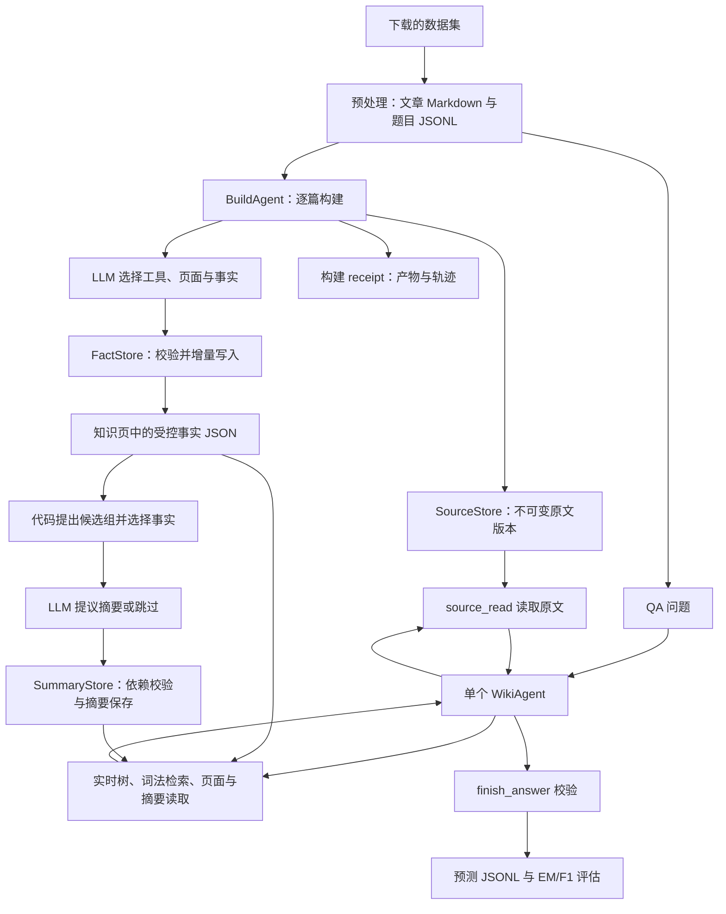

# 从原文到 Wiki，再到答案：系统学习指南

本文根据 **2026-09-15 工作区当前代码**编写，包括尚未提交的已有修改。目标是让你能解释一次生成、定位一次错误，并知道哪些地方可以由自己控制。它描述当前实现；旧实验数字和设计愿景不作为当前行为的证据。

配套文件：[全部 213 个函数／方法的逐项索引](function-reference.md)。源码中，每个显式函数都增加了中文用途注释，包括类方法和嵌套辅助函数。注释用 `#`，保留原 docstring 和运行逻辑。测试代码作为阅读实验使用，没有改写测试。

## 0. 最先建立的理解

**这个系统是“LLM 提议下一步，Python 执行操作并检查部分条件”的循环。**

比如 LLM 可以提议：“把 Lin 在 Bay University 工作写成一条事实”。它不能直接凭这句话修改任意文件。程序需要接到 `fact_apply`，检查目标路径、页面版本、来源引文等，才会写盘。

但这些检查不能自动回答：“这一事实是否遗漏了条件？”“这段原文真的支持它吗？”这部分仍主要由模型判断。因此，你的不确定感有实际原因：**程序约束了操作方式，仍把大量内容选择和语义判断交给模型。**

要掌握系统，分开看四件事：

1. **原料**：哪篇原文、哪个版本，模型实际读到了哪一段？
2. **决策**：它为什么选这个实体页、抽这条事实、写这个关系？
3. **硬条件**：程序拒绝什么，接受什么？
4. **记录**：最后哪些文件改变了，哪个工具调用导致改变？

### “function”有两个不同含义

| 名称 | 实际是什么 | 例子 |
|---|---|---|
| Python 函数 | 仓库里的可执行代码 | `SourceStore.archive()`、`FactStore.apply()` |
| LLM tool/function call | 模型返回的结构化操作请求 | `fact_apply({path, facts, ...})` |

`tool_schema()` 只描述请求格式。`call_llm_with_tools()` 向模型发送这些描述。收到模型回复后，`BuildAgent.ingest()` 或 `WikiAgent.retrieve()` 解析工具名和参数，调用本地 Python。

`finish_document` 并没有同名 Python 函数：它是 `BuildAgent.ingest()` 内的一个分支。`finish_answer` 对应 `WikiAgent._finish()`。找代码时不要只搜索 `def finish_answer`。

工具 Schema 也不是完整的运行时验证器：这里没有统一对每个请求执行 JSON Schema 校验，真正能阻止操作的条件是各个 Python 分支里的检查。

## 1. 从哪里开始读

不要从 5,000 多行的 `bench_ingest.py` 第一行开始。那个文件的大部分是保留的旧流程。

| 课次 | 阅读入口 | 读完应能回答的问题 |
|---|---|---|
| 1 | 本文第 2–3 节；[wiki_store.py](../llm_wiki_bench/wiki_store.py) | 原文、事实、页面版本有什么区别？ |
| 2 | 第 4 节；[build_agent.py](../llm_wiki_bench/build_agent.py) | 一篇文章为什么完成或失败？ |
| 3 | 第 5 节；[build_summaries.py](../llm_wiki_bench/build_summaries.py)、[summary_store.py](../llm_wiki_bench/summary_store.py) | 谁选摘要材料，什么导致摘要失效？ |
| 4 | 第 6 节；[wiki_retriever.py](../llm_wiki_bench/wiki_retriever.py) | 搜索结果怎么排，模型看到了什么？ |
| 5 | 第 7–8 节；[wiki_agent.py](../llm_wiki_bench/wiki_agent.py) | 答案怎样被接受，哪里还可能错？ |
| 6 | 第 9–12 节；运行入口、配置和测试 | 怎样控制预算、复现轨迹、定位错误？ |
| 7 | 第 13 节及函数索引中的旧函数 | 原流程为什么显得特别难控制？ |

每次读函数先看：输入 → 修改的状态 → 下游调用 → 返回值／异常。遇到长循环，先标出 `if name == ...` 分发分支，再看错误处理，不必先逐行背语法。

## 2. 全系统路径图



这里的 memory 是持久化知识和记录，不是训练模型权重，也不是自动学习到模型参数里。每篇构建、每个 QA 问题都创建新的 `messages`；之前知识主要通过 Wiki 文件和检索进入上下文。默认 QA 也不会把答案再写成知识事实。

### 当前真实调用链

```text
离线构建
run.main
  → run_one → step_download / step_preprocess / step_ingest
  → bench_ingest.ingest_batch                 # 当前入口，直接转发
  → build_agent.ingest_documents
      → BuildAgent.ingest                    # 每篇独立 messages
          → SourceStore.archive
          → call_llm_with_tools ↔ 工具分发
          → FactStore.apply / 完成验收
      → build_summaries                      # 批次之后的一层摘要

问答
run_qa.main
  → WikiRetriever.load
  → WikiAgent.retrieve                       # 每题独立 messages
      → call_llm_with_tools ↔ 工具分发
      → WikiAgent._finish
  → 写 predictions JSONL
  → evaluate.evaluate                        # 可选，不调用模型
```

## 3. 文件、身份和版本：先理解存储

### 3.1 哪些文件是原料，哪些是派生结果

以下是目录格式示意，不代表每个数据集已经拥有所有产物。

```text
raw/<dataset>/articles/*.md             预处理文章：构建输入
data/<dataset>/qa_pairs.jsonl           问题、标准答案、支撑标题
purpose_<dataset>.md                   本数据集构建目标（存在时优先）
configs/purpose_bench.md               默认构建目标
wiki_output/<dataset>/wiki/
  sources/versions/<sid>--<vid>.md      完整输入文本的不可变快照
  sources/versions/<sid>--<vid>.json    身份、标题、长度等元数据
  <内容目录>/*.md                      知识页：旧正文及受控事实块
  summaries/<子页集合哈希>.md          一层跨文档摘要
  .build/receipts/<sid>-<vid>.json      每篇文档完成状态、产物和 trace
  .build/summary-decisions/*.json      摘要生成／跳过／失败决策缓存
  .build/summary-last-run.json         批次自动摘要的最近一次报告
  .summary-history/...                被替换的摘要历史
  .repair-backups/...                 显式 repair 操作的备份
results/<dataset>/predictions.jsonl    答案、引用、轨迹、用量
```

`sources/articles`、`sources/digests`、`_index.md` 主要与旧格式有关；初始化仍可能创建这些目录。当前系统以实际目录扫描工作，不要求先维护所有 `_index.md`。

### 3.2 四种 ID 不要混用

| 字段 | 如何产生 | 解决什么问题 |
|---|---|---|
| `source_id` | SHA-256(明确的来源 identity) | 这是哪个来源？ |
| `version_id` | SHA-256(完整归档文本) | 这是该来源哪一份文本？ |
| 页面 `revision` | SHA-256(整个页面文本) | 从你读完到写入，页面是否变了？ |
| 事实 `id` | SHA-256(排序后的限定事实字段 JSON) | 这条结构化陈述的字面字段是否一样？ |

预处理把来源 identity 写成类似 `hotpotqa:wikipedia:<title>`。构建优先用 `source_identity`，没有时退回输入文件的绝对 URI。标题相同不自动代表同一 Wiki 实体；这是两套身份问题。

原文快照保留**整个输入文件**，包括 YAML 和 Markdown 标题。因此引用偏移量从归档全文开头计算，不是只从文章正文开头计算。预处理文件名末尾的正文短哈希，也不要拿来充当归档 `version_id`。

`[start,end)` 是 Python Unicode 字符区间：含 start、不含 end；不是 UTF-8 字节数，也不是 token 数。`source_read` 返回段落位置和 `next_start`，让模型尽量少猜偏移。

### 3.3 一条事实的结构

下面是结构示意，省略真实哈希值，不应原样提交给工具。

```json
{
  "statement": "Lin works at Bay University.",
  "event_time": "",
  "conditions": "",
  "polarity": "positive",
  "certainty": "asserted",
  "kind": "fact",
  "citations": [{
    "source_id": "<来源的64位哈希>",
    "version_id": "<文本的64位哈希>",
    "start": 0,
    "end": 28,
    "quote": "<该区间的原文>"
  }],
  "conflicts_with": [],
  "supersedes": []
}
```

事实 ID 由 `statement/event_time/conditions/polarity/certainty/kind` 六个字段决定。引文不参与此 ID：同样陈述可以追加其他来源证据。换一个措辞通常就是新 ID，系统没有自动做语义等价合并。

事实存在页面的 `<!-- wiki-facts:start -->` 与结束标记之间的 JSON 块中。`FactStore.apply()` 只替换这块，保留旧正文。已有页的 `title/description/aliases` 不会因为新参数自动重写；这些元数据在新建页时设置。

`conflicts_with` 表示保留冲突，`supersedes` 表示明确替代；引用必须指向该页当前已知事实。旧事实仍在磁盘上。用于摘要的 `current_facts()` 会排除被替代者，但普通 facts 视图和 BM25 statement 索引仍可能包含它们。

### 3.4 “校验引文”实际做了什么

`SourceStore.validate_citation()`：

1. 检查 source/version 是否存在、快照是否完整。
2. 检查给定区间合法、quote 非空。
3. 如果区间里的文本等于 quote，直接接受。
4. 否则先在给定范围、再在全文寻找 quote 并纠正偏移。
5. 仍失败时尝试空白、大小写差异，以及去掉模型添加的尾标点；存储实际匹配的原文切片。

所以当前它是**匹配并纠偏**，不是“任何偏移错误都立即拒绝”。如果原文有多处相同句子，回退匹配可能落到第一处。构建和 QA 会继续对纠正后的区间检查“本次是否读过”。

它没有判断 `statement` 与引文之间的语义关系。比如引用是“某人未在 2000 年前搬家”，模型却提交“某人于 1999 年搬家”，只要引文自身存在，文本匹配检查不能识别这个推理错误。

## 4. 一篇文章怎样变成 Wiki

主函数：[BuildAgent.ingest](function-reference.md#buildagentingest)。可在函数索引搜索完整名称定位。

### 4.1 开始时由代码做的事

1. 读取整篇文章，取明确来源 identity。
2. 归档原文；这一步在调用模型之前。
3. 查对应 receipt。若已 complete 且产物仍可验证，直接返回 `cached=True`。
4. 建立新的 `read_ranges`、页面 `revisions`、工具 trace 和模型用量表。
5. 给模型 `SYSTEM`、选中的 purpose 文本、来源记录和实时树。

新模型会话并没有自动收到整篇原文内容；需要通过 `source_read` 获取。树包含全部可见目录的名称、描述、页数及根页，不包含所有子页全文。

### 4.2 模型可以做哪些决定

| 决定 | 模型提出什么 | 程序检查什么 |
|---|---|---|
| 到哪里找现有知识 | 搜索词、实体名、目录、页面 | 工具参数、路径、窗口限制 |
| 是旧实体还是新实体 | 目标 path 和 identity | 已有受控 identity 是否一致；不自动语义消歧 |
| 保留哪些内容 | 事实陈述、时间、条件、否定、确定性 | 必要字段和部分枚举；不检查抽取是否遗漏 |
| 如何表达关系 | kind=relation、links | 至少两个不同且已存在的外部目标页 |
| 是否矛盾或更新 | conflicts_with/supersedes | 事实引用是否存在；不裁判冲突谁对 |
| 是否已完成 | finish_document 请求 | 全文读取覆盖、产物和 unresolved |

关系页只保证链接目标存在，并不保证“两个链接之间确有模型声称的关系”。prompt 要求读完后再补相关更新；实际要不要调用工具更新邻页仍由模型选择，`review_related` 只是返回线索。

### 4.3 提交事实的两层检查

第一层在 `BuildAgent.ingest()`：

- 已有页需要本会话获取的 revision，通常来自 `wiki_read`，成功写入后也会更新。
- 每条引文对齐后，必须被本会话 `source_read` 的区间覆盖。
- 路径没扩展名时会补 `.md`。

第二层在 `FactStore.apply()`：

- 加锁，重新读磁盘 revision，防止读完之后别人改了页面。
- 校验路径、identity、事实字段、引文、冲突 ID 和链接。
- 合并相同事实的证据，保留其他事实与旧正文。
- 原子写入一个页面，返回新 revision 和事实 ID。

**跨多个页面没有事务回滚。** 第一个页面成功、第二个失败时，第一个仍保留。partial 的意思是这篇文章未完整完成，不是“没有任何改动”。

### 4.4 为什么 complete 不能理解成“这篇文章已经完整学会”

`finish_document` 必须满足：

- 当前来源全文字符区间已被读取。
- `unresolved` 为空。
- receipt 中有产物，所列事实仍存在且包含当前来源版本的有效引文。

这些条件没有逐条对照原文里的所有事实。只写一条有效事实也可能通过；`unresolved` 是模型报告的待办，不是程序自动计算的任务全集。“读取完”也只表示内容已返回给模型，不表示它理解和记住了所有内容。

### 4.5 何时停止

- 默认每文档 `INGEST_TOOL_BUDGET=40`；包括构建中的 finish 请求和失败工具调用。
- 连续 5 个完全相同工具请求、3 次完成验收被拒、8 次连续工具错误，会触发停止。
- 默认 `INGEST_TOKEN_BUDGET=250000`：按模型返回的累计 usage，在下一轮调用前检查。不是精确费用上限；缺失 usage 无法完整统计，也可能单次调用跨过阈值。
- 模型调用无响应或其他异常会记录错误；未成功完成的文档保留 partial 和缺口。

调整 prompt 不会自动使 complete receipt 失效：文档缓存身份主要是来源及版本，不包含 prompt 或 purpose 的哈希。需要重新实验时明确使用文档 `force=True`，并理解它是在现有页上继续写事实，不是清空重建。

## 5. 摘要怎样产生，以及哪里可控

当前有两种容易混淆的“summary”：

| 形式 | 存放与用途 |
|---|---|
| 普通知识页 `kind=summary` 事实 | `wiki_read(view="summary")` 优先显示未被替代的这种陈述，没有时用 description |
| 跨文档摘要 | 独立 `summaries/*.md`，有 children、claims、supports 和来源版本依赖；用 `summary_read` 展开 |

第二种是一层编译结果，不会递归把摘要再做成摘要。

### 5.1 谁决定摘要看哪些资料

`eligible_pages()` 挑出有当前 fact/relation、且引文可验证的知识页。旧自由正文不能直接升级为摘要依据。

`candidate_pairs()` 先找已有摘要组供重建，再为种子页寻找显式链接或 BM25 有分数的其他页。显式链接优先，每个种子最多三个候选，配对去重。存储支持 2–4 页，但自动新组主要生成两页组合；这不是向量聚类，也不是模型遍历全部页面后自行选组。

`evidence_packet()` 按事实现有顺序挑选材料：每页最多八条，组内默认 32,000 字符预算均分，超预算的整条事实跳过。它不根据当前用户问题排序，因为这是离线摘要阶段。

**因此，摘要遗漏可能在模型调用之前就发生。** 先检查包里的 `selected_facts`，再讨论模型为什么没总结到某条事实。

### 5.2 模型与代码怎样配合

每组通常是一次模型调用，不是构建 Agent 那样反复补工具的循环。模型返回且仅返回一个工具：

- `write_summary`：标题、1–8 条陈述、direct/synthesis 类型和材料中的支撑 ID。
- `skip_summary`：相关性或证据不足时给理由。

代码将临时支撑 ID 转成真实页面／fact_id，再从叶事实推导原文引文。模型不能直接在这一步自己编造一套引文位置。

`SummaryStore.apply()` 检查整体用到了全部子页和至少两个来源身份。这是**整个摘要**的约束，不要求每条 claim 都跨两个来源。每条陈述最多 1,200 字符，总陈述最多 4,000 字符；每条支撑数量也有限制。

这些规则限制结构和来源覆盖，仍不证明综合推导成立。

### 5.3 过期是什么

子页任何文本变化导致 revision 改变；同来源出现另一个已归档版本；依赖缺失或引文完整性失败，都可以令摘要 stale。

- 正常搜索隐藏 stale 摘要。
- 直接读 stale 摘要只返回状态、原因和子页导航。
- 最终提交 `summary_refs` 时再检查新鲜度。
- 重建会保存旧摘要到 `.summary-history/`。

`current` 只意味着当前依赖检查通过。不等于最新世界知识；版本集合也没有“哪一个才是最新事实”的自动裁决。

### 5.4 缓存和重试的细节

| 已有状态 | 默认下次运行 |
|---|---|
| 摘要存在且未过期 | 直接 cached，即使更换模型／prompt 也可能复用 |
| 相同 signature 的 skipped | 复用跳过决定 |
| 相同 signature 的多数校验型 failed | 复用失败缓存，不重新调用模型 |
| 模型返回 None 的调用失败 | 不写该类失败决策缓存，可再次尝试 |
| 摘要文件本身损坏、无法解析 | 记 failed；不是自动覆盖损坏文件 |

失败／跳过 signature 包括页面 revision、来源版本集合、模型和摘要 SYSTEM。`--force` 绕过相关缓存，但不绕过格式、来源和依赖校验。`resume_summaries` 复用这些缓存，队列清空不代表历史失败全修好了。

文档构建 `--force` 没有传给摘要阶段的 `force`。要明确强制摘要重建，使用 `build_summaries --force`，它作用于本次候选组，不只是失败项。

## 6. 检索器究竟在做什么

默认检索不调用模型，也不使用 embeddings。模型负责选择 query，Python 负责找和排候选。

### 6.1 搜索基础

`load()` 根据实际文件和目录刷新内存索引，使用路径、修改时间及文件大小检测变更。隐藏文件和符号链接被排除；坏页面元数据被记录并尽量降级为可读正文。

BM25 可以直观理解为：查询词在某页出现越多可能越相关；很多页都有的常见词贡献较小；同时校正文档长短。这里参数写在 `_bm25_score()`：`k1=1.2`、`b=0.75`。

索引包含标题、别名、标签、描述和正文。受控事实块只索引 statement，避免哈希、JSON 字段名和重复引文淹没词频。来源全文页也会参与 details 检索，所以某个事实没被抽进知识页，仍有机会从归档原文直接找到；能否找得到还取决于词法匹配。

`_tokenize()` 支持 Unicode 字符，但没有中文分词器，不能把“支持 Unicode”理解成“中文词语检索已充分优化”。

### 6.2 给模型的工具清单

| 工具 | 本地实现 | 返回与作用 |
|---|---|---|
| `wiki_tree` | `WikiRetriever.tree` | 实时目录导航，不是全文上下文 |
| `wiki_search` | `WikiRetriever.search` | 候选 path/name/score/meta；layer 可选 all/details/summaries |
| `entity_lookup` | `search(mode="exact")` | 完整标题／别名匹配；同名多个结果仍需消歧 |
| `wiki_read` | `WikiRetriever.read` | 列目录或读页面／章节／facts／relations／summary |
| `source_read` | `SourceStore.read` | 完整性验证过的原文窗口，建立已读证据范围 |
| `summary_read` | `SummaryStore.read` | overview、claims、单条 evidence |
| `fact_apply` | `FactStore.apply`＋构建前置检查 | 仅构建 Agent 提交知识事实 |
| `finish_document` | `BuildAgent.ingest` 分支 | 提交文档完成请求 |
| `evidence_note` | `WikiAgent.retrieve` 分支 | 记录当前缺口和新增证据，不代表代码认可其语义 |
| `finish_answer` | `WikiAgent._finish` | 提交最终答案验收 |

搜索不返回普通页全文，但 metadata 中可能带 description；摘要 description 可能已经包含概览。渐进披露主要控制详细支撑事实及引文，不代表搜索阶段完全不展示摘要内容。

### 6.3 读窗口的三个陷阱

1. 目录 `start` 是条目下标；文件 `start` 是所选文本视图的字符位置。
2. `wiki_read(view="facts")` 的位置在序列化 JSON 中，不是原文位置。
3. `wiki_read` 返回来源链接不等于已调用 `source_read`。最终证据覆盖由后者建立。

默认文件窗口 6,000 字符，最多 12,000；一次最多 15 条路径。目录默认 50 页、最高 200 页，沿 `next_start` 继续读。

还有一个副作用：读取旧 `sources/articles` 或指向它的页面时，`_source_refs()` 可能自动归档旧原文。因此，兼容旧语料时“读取 Wiki”可能会新写 `sources/versions` 快照。

## 7. 一个问题怎样得到答案

当前 CLI 明确设置 `allow_subtasks=False`，由一个 premium 模型同时探索和回答。代码保留 `verify_subtask` 的显式 Python 兼容分支，默认不使用。

### 7.1 模型的每一轮看到什么

初始：QA SYSTEM、问题、实时树、范围和工具预算。

之后：之前的 assistant 消息、每次工具结果、错误，以及继续探索／提交结果的提示，逐轮累积。一个模型回复可以包含多个工具请求，程序依次执行。

渐进读取减少单次披露的材料，但当前没有把整个历史做可靠压缩的全局上下文管理。温度为 0 也不应视作每次选择与输出必然完全相同。

### 7.2 分清检索、观测、提交三个职责

- `retrieve()` 管循环、预算、重复请求和错误。
- `_scope_arguments()` 限搜索数量和可选作用范围。
- `_observe()` 把实际成功读到的原文范围、页面和摘要展开记录记到账本。
- `_finish()` 检查最终请求并写 `RetrievalResult`。

`evidence_note` 的 gaps 是模型的自述；`source_ranges` 才是工具实际读过范围的代码记录。两者证据强度不同。

### 7.3 最终验收条件与盲区

普通答案：必须有可验证且已读过的原文引文，非 unknown 答案必须是 `found`。非 found 结果应是 unknown，并说明缺口。代码会把某些 `Yes, ...` / `No, ...` 格式规整成短答案。

如果模型显式填写 `summary_refs`，还必须证明该摘要版本仍 current、对应 claim 已展开至 evidence，以及最终引文覆盖每条支撑事实的引文。

**没有 summary_refs 时，程序不会自动推导出这道题需要几跳证据。** 它也不能检查模型是否偷偷依赖某个摘要却没申报。`reasoning` 是模型生成的解释文本，不是机器验证的证明；found 也未强制要求 gaps 一定为空。

因此，“通过 `_finish()`”应理解为协议和引用条件通过，不能直接理解为答案正确。

### 7.4 QA 预算与输出

默认 `t_max=30` 限制非 finish 的工具调用，失败请求和 `evidence_note` 也消耗预算。`finish_answer` 不计在这个探索计数里。用尽后最多再给两次 final-only 模型机会。

连续重复工具请求以及多次最终验收失败也会提前停。`patience` 参数保留但不再按若干次空搜索提前终止。

最终 `run_qa` 保存：prediction、status、citations、summary_refs、reasoning、evidence_gaps、tool_trace、usage_by_model 等。`llm_calls` 是程序层调用数；HTTP 客户端内部重试不单独增加这个计数，返回 usage 也不保证包括所有失败请求的消耗。

## 8. 用一个两跳例子把它串起来

采用测试里的虚构例子：

```text
原文 A：Lin works at Bay University.
原文 B：Bay University is in Singapore.
问题：Where is Lin's employer?
答案：Singapore
```

### 第一步：归档与构建事实

程序分别保存 A/B 快照。构建模型通过 source_read 读原文，提议两条知识事实，并将引文提交给 `fact_apply`。程序生成真实 ID 和 revision，保存 receipt。

注意：原文 A 不足以证明“Lin 住在 Singapore”。即使这句也是模型能写出来的语言，系统不应该因为两个词共现就当成事实。当前硬检查不能自动裁决这个区别，必须看语义。

### 第二步：摘要

代码从两个知识页选择事实包，模型可以提出：“Lin 的雇主位于 Singapore”，标为 synthesis，关联 A/B 的事实 ID。程序从叶事实生成两份引用，保存子页版本依赖。

### 第三步：问答

一种合法工具轨迹如下。模型也可以绕过摘要直接找细节。

```text
wiki_search("Lin employer", layer="summaries")
summary_read(path, view="overview")
summary_read(path, view="claims")
summary_read(path, view="evidence", claim_ids=[目标 claim])
source_read(A 的 source_id/version_id)
source_read(B 的 source_id/version_id)
finish_answer(answer="Singapore", citations=[A, B], summary_refs=[该 claim], ...)
```

假设先只读 A 就提交 A+B 引文，`_finish()` 会拒绝 B 未读。模型应补读 B 再提交。测试 `test_single_agent_expands_then_verifies_both_sources` 正在模拟这个过程。

但如果模型只交 A 引文、不交 summary_refs，声称 Singapore 就是答案，目前代码未必能识别缺失第二跳。这个反例清楚展示了**引用协议验证与答案语义验证的差别**。

## 9. 你可以在哪些地方控制它

| 你想控制的事 | 当前入口 | 控制的性质／限制 |
|---|---|---|
| 什么内容值得抽取 | purpose 文件、`build_agent.SYSTEM` | prompt 引导，不是抽取完整性硬约束 |
| 哪些写入合法 | `FactStore.apply`、构建 fact_apply 分支 | Python 硬条件；改这里才会拒绝不合要求的提交 |
| 使用哪些工具 | BUILD_TOOLS、WIKI_TOOL_SCHEMAS、QA tools | Schema 描述及本地分发共同决定；仅删描述不等于所有后端路径都不可调用 |
| 构建模型 | `LLM_PREMIUM_MODEL`／BuildAgent model | 当前构建直接用 premium，不走旧 fast 选页步骤 |
| 构建预算 | INGEST_TOOL_BUDGET、INGEST_TOKEN_BUDGET | 每文档；usage 可能缺失，非精确费用限额 |
| 暂不生成跨文档摘要 | `SUMMARY_BUILD_LIMIT=0` | 关闭批次后的自动摘要阶段 |
| 哪些页面组队 | `candidate_pairs`、seeds | 确定性候选策略；新组每种子最多三个候选 |
| 摘要看哪些事实 | `evidence_packet` | 确定性顺序与字符／条数限制 |
| 摘要写什么关系 | `build_summaries.SYSTEM` | 模型语义选择；存储层只做规定的结构校验 |
| QA 选择哪些候选 | query、`--search-mode`、`--select-pages` | query 由模型生成，匹配排序由代码计算 |
| QA 答案形式和行为 | `wiki_agent.SYSTEM` | prompt；必须条件另在 `_finish` 加代码 |
| QA 探索预算 | `--t-max` | 工具数，不等于 HTTP 请求数、token 或费用 |
| 答案接受标准 | `WikiAgent._finish` | 当前可改成更严格的验收，但本次只加说明 |

### 不会影响当前流程或容易误用的设置

- `LLM_FAST_MODEL`、旧 `LLM_STEP1_MODEL/LLM_STEP2_MODEL` 不是当前单 Agent 构建／QA 的默认分工。
- `LLM_TEMPERATURE` 不覆盖当前三个主要模型调用点显式传入的 `temperature=0`。
- 构建用 `LLM_MAX_TOKENS`；当前摘要和 QA 调用显式设 `max_tokens=4096`。
- `INGEST_MAX_CONTENT_LEN`、旧 prompt safety valve、Error Book 和周期修复开关主要服务旧流程。
- `--batch-size` 在当前文档构建入口只是兼容参数；`resume_summaries --batch-size` 则真正控制每轮摘要调用上限。
- `configs/wiki-schema.md` 是说明文件；当前构建 SYSTEM 没有像旧 prompt 函数一样加载它的全部内容。只改该文件不会自动改变硬校验或当前模型输入。
- 修改 purpose 直接影响后续构建输入；当前 QA SYSTEM 不直接读取 purpose 文件。

### 环境与缓存注意点

配置主要在模块导入时读取环境变量。仓库客户端没有自动读取 `.env` 的代码，仅有文件还不代表进程已获得配置。不要输出密钥来确认；只检查“是否设置”。

仓库同时保留包内相对导入和旧顶层导入。定制 Python 实验应统一导入风格，避免配置一个 `bench_config` 实例却运行使用另一实例的代码。常规 CLI 使用其已有导入路径。

## 10. 看什么记录，才能解释一次生成

### 构建：从 receipt 倒查

先找 `.build/receipts/*.json`，按这个顺序看：

1. `status/error/unresolved`：在哪个条件上没完成？
2. `products`：实际涉及哪些页、哪些事实 ID？
3. `trace` 中的 `source_read`：模型读过全文还是少了一段？
4. `trace` 中的 `fact_apply`：原始提议、纠正后的写入结果，以及错误反馈。
5. `finish_document`：为什么被拒／接受？
6. `tool_calls/llm_calls/usage_by_model`：是否因预算或卡住而停？

注意 receipt 记录的是工具轨迹，不是完整提示词和所有模型内部思考。它能解释“做了什么”，不总能证明模型“为什么这样选”。

### QA：先看第一次走偏的位置

从预测的一条 JSONL 取 `tool_trace`：

- 搜不到 → 查看实际 query、layer、directory 和候选内容。
- 搜到但没读 → 模型的下一步选择问题。
- 读到事实但没读原文 → 证据补充／工具预算问题。
- 原文读到但答错 → 语义推理或答案表达问题。
- 引文或 summary_refs 被拒 → 查看 `_finish` 具体错误与补证动作。
- status=found 但语义不成立 → 当前自动验收的边界，不能只看 status。

### 摘要：先查输入，再查输出

先确认 eligible，再检查 candidate group、选中的事实数量和内容，最后看模型 claims 和依赖。摘要报告通常不保存完整模型输入；小规模复现时可以通过注入 `call` 包装器记录 evidence packet。

症状与入口：

| 症状 | 优先检查 |
|---|---|
| 文档一直 cached，prompt 修改没效果 | receipt 和是否 force |
| 摘要一直 pending | 调用预算、候选数、续跑进度 |
| 摘要 failed 后续跑不再尝试 | summary-decisions 的 signature/status |
| 旧文档有正文但 eligible_pages=0 | 是否真正有受控且带引用的 fact/relation |
| “关系”看着牵强 | 原始 statement、supports 与原文语义；链接存在不足以证明关系 |
| 子页只改一行，摘要也失效 | 整页 revision 是依赖单位 |
| F1 很高但漏了很多题 | evaluate 的 missing；缺失预测不在分母内 |

## 11. 不调用真实模型的阅读实验

先用现有测试观察代码边界。测试用临时目录和脚本化模型回复，验证协议，不验证真实模型质量。

在仓库根目录执行（`python` 应是已安装 requirements 的环境，例如 `.venv/bin/python`）：

```bash
python -m unittest discover -s tests -v
```

建议逐个阅读这些测试的请求和断言：

| 实验 | 测试位置／名称 | 观察重点 |
|---|---|---|
| 保留原文多版本 | [test_wiki_tools.py](../tests/test_wiki_tools.py) `test_versions_and_long_original_survive` | 同 identity、不同文本得到不同 version |
| 小改动不抹掉旧知识 | 同文件 `test_local_update_preserves_legacy_and_facts` | 受控块外正文仍在 |
| 拒绝旧版本写入 | 同文件 `test_stale_revision_and_identity_mismatch` | revision 与 identity 的不同职责 |
| 新文件立即进入导航 | 同文件 `test_live_tree_read_sections_yaml_and_fences` | 实时扫描及 section 范围 |
| 摘要变旧 | [test_summaries.py](../tests/test_summaries.py) `test_changed_child_hides_stale_summary_and_rebuilds_with_history` | 子页变化→隐藏摘要→重建历史 |
| QA 先拒绝，再补证 | 同文件 `test_single_agent_expands_then_verifies_both_sources` | source_ranges 与 `_finish` |
| 禁止伪造摘要支撑 | 同文件 `test_unknown_support_and_generation_race_are_rejected` | 事实 ID 与提交时 revision 复核 |

### 手动观察一个工具往返

下面只打印现有树并读一个不可变原文窗口；不调用模型，不修改知识页。没有归档原文时只显示树。

```python
from pathlib import Path
from llm_wiki_bench.wiki_retriever import WikiRetriever

r = WikiRetriever(Path("wiki_output/hotpotqa/wiki"))
print(r.tree())
for path in sorted(r.pages):
    if path.startswith("sources/versions/"):
        source_id, version_id = Path(path).stem.split("--", 1)
        window = r.sources.read(source_id, version_id, start=0, length=200)
        print(window)
        print("下一段从这里继续：", window["next_start"])
        break
```

练习：看输出的 `start/end/text`，解释为什么它可以构造原文引用，而一个 `wiki_read(view="facts")` 的窗口不能直接这样使用。

### 小规模模型实验的范围

这些是之后运行实验时的入口说明，本次文档工作没有执行真实模型生成：

```bash
# 限制“文章数”，只构建一篇并关闭批次摘要；会写 wiki 和 receipt。
SUMMARY_BUILD_LIMIT=0 python -m llm_wiki_bench.bench_ingest --dataset hotpotqa --limit 1

# 检查摘要资格及待处理组；不提供 --output 时不写报告。
python -m llm_wiki_bench.build_summaries --wiki-dir wiki_output/hotpotqa/wiki --dry-run

# 仅一次摘要模型调用的预算；可能因缓存而零调用。
python -m llm_wiki_bench.build_summaries --wiki-dir wiki_output/hotpotqa/wiki --limit 1

# 只回答一题，使用独立预测文件；同名 output 再跑会覆盖。
python -m llm_wiki_bench.run_qa --dataset hotpotqa --limit 1 --t-max 10 --verbose --output /tmp/wiki-learning-predictions.jsonl
```

`run --limit N` 控制预处理题数；`run --only-ingest --limit N` 不会把已有文章限定为 N 篇。预处理也不会自动删除过去生成的其他文章。控制语料必须检查实际输入路径集合。

## 12. 评估究竟说明什么

[evaluate.py](../llm_wiki_bench/evaluate.py) 用确定性文本规则评分：

- EM：归一化后是否完全一致。
- F1：空白 token 的重叠程度。
- 支持答案别名，分别取最高分。
- 缺失预测计为 missing，跳过平均分分母。
- hop 分组用支撑标题数量作为代理。
- 引文数、摘要引用数、标题召回、token 用量是辅助指标。

它不会重新证明引文支持答案。答案碰巧正确但推理错误，仍可能拿到高 EM/F1。`retrieval_experiment.compare()` 更窄，只比较候选支持标题覆盖，不执行完整 QA。

所以应分开判断：工具协议是否成立、事实是否忠实、证据是否覆盖各跳、最终短答案是否正确、耗时和用量是否可接受。现有测试主要覆盖第一项及部分存储行为。

## 13. 旧系统为什么容易让人迷路

`bench_ingest.py` 保留了这样一条旧路径：

```text
_legacy_ingest_batch / _legacy_ingest_single
  → 构造目录索引提示词
  → LLM 选择 pages_to_view
  → 读取选中页面
  → LLM 生成整页 FILE 块
  → write_wiki_files
  → 模糊关联来源、补链接、索引更新
  → 周期／最终 LLM 修复、合并与目录整理
```

这条链上，页面选择、整页改写、合并、矛盾修正都可能受模型判断影响，而且一些代码启发式也会删链接或改目录。你看到大量函数名字却难以判断谁影响最终结果，很大一部分原因就是旧实现仍在同一个模块里。

当前公开 `ingest_batch/ingest_single` 已转交 `ingest_documents`；`_ingest_batch_one` 虽然名字没有 legacy，仍属于旧路径。旧 Error Book、零跳 overview 和整页修复不在当前默认链中。

这些旧函数已逐一加上“旧流程”注释，作用仍可在 [函数索引](function-reference.md) 查。不要因函数仍存在，就推断当前会调用。

## 14. 学完后你应该能做到什么

拿任意一条预测或构建 receipt，尝试独立回答：

1. 这次具体读了哪些来源版本？能定位原文字符区间吗？
2. 哪些是模型的提议，哪些是 Python 的硬条件？
3. 为什么目标页是这个实体，而不是同名另一个实体？这有证据还是模型假设？
4. 哪个工具请求真正改变了哪个文件？失败有没有留下局部增量？
5. 摘要依据了哪些事实？哪些原文内容根本没进材料包？
6. 最终答案的每一步推导分别由哪段原文支持？有没有只通过引用格式、却不成立的推理？
7. 改 prompt 后为何可能仍 cached？应该重建哪一层？
8. 调一个配置会影响当前入口，还是只影响旧流程？

能沿着“请求 → 检查 → 写入／观测 → 最终验收”解释一条完整轨迹，就已经掌握系统的核心。之后再决定哪些语义判断需要更严格规则、人工审核或额外评估；这些都是后续设计选择，当前不能假装它们已经存在。
